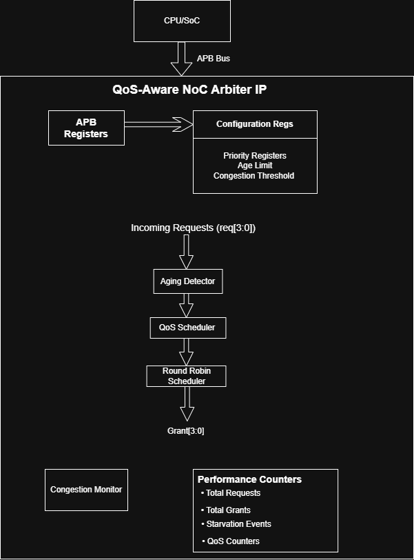
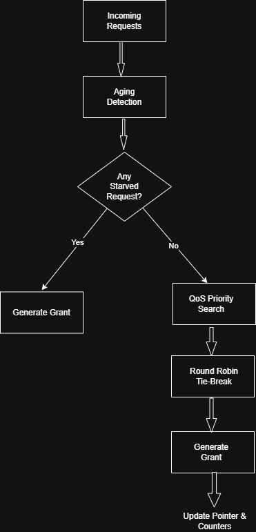
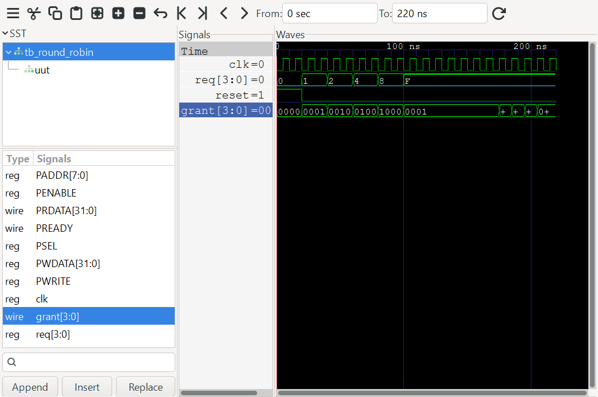
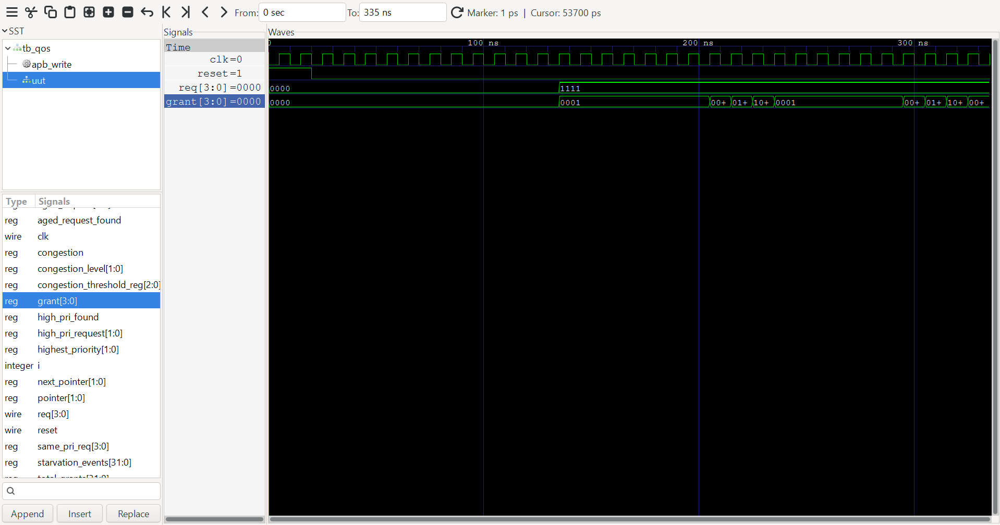
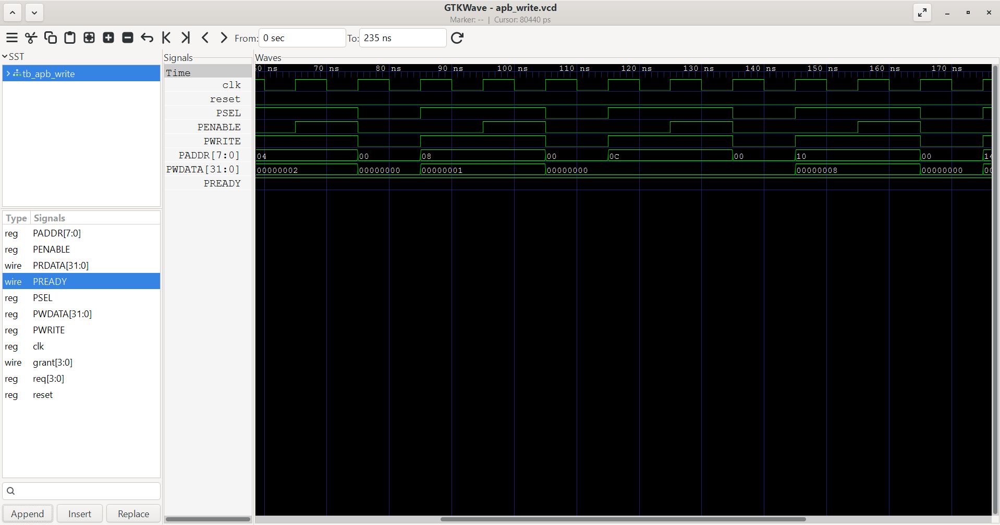
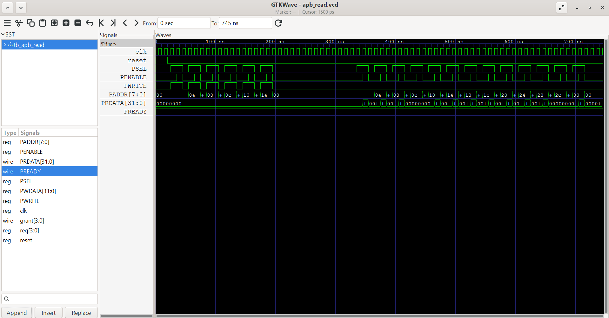

# QoS-Aware NoC Traffic Arbitration IP


*A configurable Verilog-based Network-on-Chip (NoC) traffic arbitration IP featuring QoS-aware scheduling, Round-Robin arbitration, aging-based starvation prevention, congestion monitoring, runtime performance counters, and an APB memory-mapped configuration interface.*

---

## Project Overview

Modern System-on-Chip (SoC) designs often contain multiple bus masters competing for access to shared resources such as memory controllers, interconnects, or peripherals. A simple fixed-priority arbiter can lead to starvation of low-priority masters and poor Quality of Service (QoS).

This project implements a **QoS-Aware Network-on-Chip (NoC) Traffic Arbiter** in Verilog that provides configurable scheduling policies while maintaining fairness and preventing starvation. The design also includes an **APB slave interface** for runtime configuration and exposes **performance counters** to monitor arbitration behavior.

The project was developed with a modular RTL architecture and verified through multiple simulation testbenches using **Icarus Verilog** and **GTKWave**.

---

## Table of Contents

- [Project Overview](#project-overview)
- [Why This Project?](#why-this-project)
- [Key Features](#key-features)
- [Architecture](#architecture)
- [Arbitration Pipeline](#arbitration-pipeline)
- [Repository Structure](#repository-structure)
- [Getting Started](#getting-started)
- [Project Build](#project-build)
- [Running the Simulation](#running-the-simulation)
- [Viewing Waveforms](#viewing-waveforms)
- [APB Register Map](#apb-register-map)
- [Performance Counters](#performance-counters)
- [Verification](#verification)
- [Results](#results)
- [Waveform Gallery](#waveform-gallery)
- [Future Enhancements](#future-enhancements)
- [Technologies Used](#technologies-used)
- [License](#license)
- [Author](#author)

---

## Why This Project?

This project demonstrates the design and verification of a configurable hardware IP that addresses common arbitration challenges in modern System-on-Chip (SoC) interconnects. It showcases RTL design, APB integration, verification, and performance monitoring techniques commonly used in FPGA and ASIC development.
---

## Key Features

* Configurable QoS priority levels
* Round-Robin arbitration for fair request servicing
* Aging-based starvation prevention
* Equal-priority Round-Robin tie-breaking
* Runtime QoS configuration through an APB slave interface
* Congestion monitoring with programmable threshold
* Performance counters for traffic analysis
* Modular and reusable RTL design
* Comprehensive verification testbenches
* GTKWave waveform validation
---

## Architecture

The QoS-Aware NoC Traffic Arbitration IP is organized into modular RTL blocks to improve readability, reusability, and scalability.

<p align="center">
  
</p>

### Architecture Overview

The design consists of the following functional blocks:

* **Request Interface** – Receives request signals from multiple bus masters.
* **Aging Logic** – Detects requests that have waited longer than the programmed age limit.
* **QoS Scheduler** – Selects the highest-priority request based on programmable QoS levels.
* **Round-Robin Arbiter** – Resolves conflicts between requests with equal priority while maintaining fairness.
* **Congestion Monitor** – Tracks the number of active requests and reports congestion status.
* **Performance Counters** – Records arbitration statistics such as total requests, grants, starvation events, and QoS-specific grants.
* **APB Slave Interface** – Allows software to configure priorities, age limit, congestion threshold, and read performance counters.

---

## Arbitration Pipeline

The arbitration decision follows the pipeline shown below.

<p align="center">
  
</p>

The arbitration flow is:

1. Receive incoming requests from all masters.
2. Check whether any request has exceeded the programmed aging threshold.
3. If a starved request exists, service it immediately.
4. Otherwise, compare QoS priorities.
5. Apply Round-Robin arbitration among requests with equal priority.
6. Issue the grant signal.
7. Update congestion status and performance counters.

---

## Repository Structure

```text
qos-aware-noc-arbiter/
│
├── rtl/
│   ├── arbiter.v
│   ├── fifo.v
│   └── noc_top.v
│
├── tb/
│   ├── arbiter_tb.v
│   ├── fifo_tb.v
│   ├── tb_round_robin.v
│   ├── tb_qos.v
│   ├── tb_starvation.v
│   ├── tb_apb_write.v
│   └── tb_apb_read.v
│
├── docs/
│   ├── architecture.png
│   ├── arbitration_pipeline.png
│   └── register_map.png
|   ├── round_robin.png
|   ├── qos.png
|   ├── apb_write.png
|   └── apb_read.png
│
├── waveforms/
│   ├── arbiter.vcd
│   ├── round_robin.vcd
│   ├── qos.vcd
│   ├── starvation.vcd
│   ├── apb_write.vcd
│   └── apb_read.vcd
│
├── README.md
├── LICENSE
└── .gitignore
```
---

# Getting Started

## Prerequisites

The project has been developed and verified using the following tools:

| Tool               | Purpose                        |
| ------------------ | ------------------------------ |
| Icarus Verilog     | RTL compilation and simulation |
| GTKWave            | Waveform visualization         |
| Visual Studio Code | RTL development and editing    |
| Git                | Version control                |

---

## Clone the Repository

```bash
git clone https://github.com/KaashyaPing/qos-aware-noc-arbiter.git
cd qos-aware-noc-arbiter
```

```

---

# Project Build

Compile the main arbiter and verification testbench using Icarus Verilog:

```bash
iverilog -o arbiter rtl/arbiter.v tb/arbiter_tb.v
```

If compilation succeeds, an executable named **arbiter** will be generated.

---

# Running the Simulation

Execute the simulation:

```bash
vvp arbiter
```

Typical simulation output:

```text
Request = 1111
Grant   = 0001

Priority Updated

Age Limit Updated

Congestion Threshold Updated

Total Requests = ...

Total Grants = ...

Starvation Events = ...
```

---

# Viewing Waveforms

The simulation generates a Value Change Dump (VCD) file.

Open it using GTKWave:

```bash
gtkwave waveforms/arbiter.vcd
```

Additional waveform files included in this repository:

* `waveforms/round_robin.vcd`
* `waveforms/qos.vcd`
* `waveforms/starvation.vcd`
* `waveforms/apb_write.vcd`
* `waveforms/apb_read.vcd`

These waveforms demonstrate:

* Round-Robin fairness
* QoS-aware scheduling
* Aging-based starvation prevention
* APB write transactions
* APB read transactions
---

# APB Register Map

The arbiter includes an APB slave interface that allows software to configure arbitration behavior and monitor runtime statistics.

| Address | Register             | Description                                       |
| ------: | -------------------- | ------------------------------------------------- |
|  `0x00` | Priority 0           | QoS Priority for Master 0                         |
|  `0x04` | Priority 1           | QoS Priority for Master 1                         |
|  `0x08` | Priority 2           | QoS Priority for Master 2                         |
|  `0x0C` | Priority 3           | QoS Priority for Master 3                         |
|  `0x10` | Age Limit            | Starvation prevention threshold                   |
|  `0x14` | Congestion Threshold | Active request threshold for congestion detection |
|  `0x18` | Total Requests       | Total number of arbitration requests              |
|  `0x1C` | Total Grants         | Total grants issued                               |
|  `0x20` | Starvation Events    | Number of starvation-prevention events            |
|  `0x24` | QoS0 Grants          | Grants issued to QoS Level 0                      |
|  `0x28` | QoS1 Grants          | Grants issued to QoS Level 1                      |
|  `0x2C` | QoS2 Grants          | Grants issued to QoS Level 2                      |
|  `0x30` | QoS3 Grants          | Grants issued to QoS Level 3                      |
|  `0x34` | Counter Reset        | Clears all performance counters                   |

> **Register Map Diagram**

<p align="center">
  
</p>

---

# Performance Counters

To aid debugging and performance analysis, the arbiter maintains several runtime counters that can be read through the APB interface.

| Counter               | Purpose                                                    |
| --------------------- | ---------------------------------------------------------- |
| **Total Requests**    | Counts every incoming arbitration request.                 |
| **Total Grants**      | Counts every grant issued by the arbiter.                  |
| **Starvation Events** | Tracks the number of requests serviced due to aging logic. |
| **QoS0 Grants**       | Number of grants issued at QoS Level 0.                    |
| **QoS1 Grants**       | Number of grants issued at QoS Level 1.                    |
| **QoS2 Grants**       | Number of grants issued at QoS Level 2.                    |
| **QoS3 Grants**       | Number of grants issued at QoS Level 3.                    |

These counters provide visibility into arbitration fairness, traffic distribution, and Quality of Service behavior during simulation and future SoC integration.
---

# Verification

The QoS-Aware NoC Traffic Arbitration IP was functionally verified using multiple directed testbenches developed in Verilog. Each testbench focuses on validating a specific feature of the arbiter to ensure correct operation under different traffic conditions.

| Testbench          | Purpose                                                                                                         |
| ------------------ | --------------------------------------------------------------------------------------------------------------- |
| `arbiter_tb.v`     | Comprehensive verification of arbitration logic, APB interface, congestion monitoring, and performance counters |
| `tb_round_robin.v` | Validates fair Round-Robin arbitration among equal-priority requests                                            |
| `tb_qos.v`         | Verifies QoS-aware scheduling based on programmable priorities                                                  |
| `tb_starvation.v`  | Demonstrates aging-based starvation prevention                                                                  |
| `tb_apb_write.v`   | Validates APB write transactions                                                                                |
| `tb_apb_read.v`    | Validates APB read transactions                                                                                 |
| `fifo_tb.v`        | Verifies FIFO functionality used within the design                                                              |

---

# Results

The implemented arbiter successfully demonstrates:

* Fair Round-Robin scheduling
* Runtime programmable QoS priorities
* Aging-based starvation prevention
* Equal-priority tie-breaking
* APB-based runtime configuration
* Congestion detection using programmable thresholds
* Runtime performance monitoring through hardware counters

Simulation results confirmed correct arbitration behavior across all verification scenarios.

---

# Verification Summary

| Feature                    | Status |
| -------------------------- | :----: |
| Fixed Priority Arbitration |    ✅   |
| Round-Robin Arbitration    |    ✅   |
| QoS Scheduling             |    ✅   |
| Aging Logic                |    ✅   |
| Starvation Prevention      |    ✅   |
| APB Write Transactions     |    ✅   |
| APB Read Transactions      |    ✅   |
| Congestion Monitoring      |    ✅   |
| Performance Counters       |    ✅   |
| GTKWave Verification       |    ✅   |
---

# Waveform Gallery

The following waveforms were captured using **GTKWave** during functional verification of the QoS-Aware NoC Traffic Arbitration IP.

## Round-Robin Arbitration

The waveform below demonstrates fair arbitration among masters with equal priority. The grant rotates sequentially, ensuring that no requester is continuously favored.

<p align="center">
  
</p>

---

## QoS-Aware Scheduling

This waveform demonstrates arbitration based on programmable QoS priorities. Higher-priority requests are serviced first while preserving fairness among requests with the same priority.

<p align="center">
  
</p>

---

## APB Write Transaction

The APB write interface is used to configure runtime parameters such as QoS priorities, age limit, and congestion threshold.

<p align="center">
  
</p>

---

## APB Read Transaction

The APB read interface provides software access to configuration registers and runtime performance counters.

<p align="center">
  
</p>

---

# Future Enhancements

The current implementation provides a configurable and reusable QoS-aware arbitration IP. Several enhancements could further extend its capabilities for larger SoC and NoC deployments.

* Support for a configurable number of masters using parameterized RTL.
* Weighted Round-Robin (WRR) arbitration for bandwidth allocation.
* Dynamic QoS adaptation based on traffic conditions.
* Migration from an APB interface to an AXI4-Lite configuration interface.
* Integration into a larger multi-router Network-on-Chip architecture.
* UVM-based constrained-random verification environment.
* Formal verification using SystemVerilog Assertions (SVA) and formal property checking.
* Synthesis, timing, and resource utilization analysis on FPGA platforms.
* Support for configurable arbitration policies selectable at runtime.

---

# Technologies Used

* Verilog HDL
* Icarus Verilog
* GTKWave
* Visual Studio Code
* Git & GitHub
* Draw.io

---

# License

This project is released under the MIT License. See the `LICENSE` file for additional information.
---
# Author

**Kaashyap Sai Varma Bhupathiraju**

Electronics and Communication Engineering Student

GitHub: [@KaashyaPing](https://github.com/KaashyaPing)

This project was developed as a portfolio-quality RTL design to demonstrate digital design, hardware verification, and SoC interconnect concepts relevant to FPGA and ASIC development.

